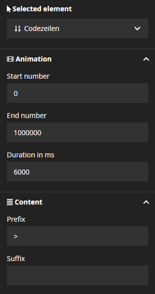
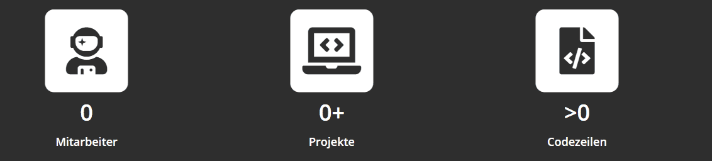

[](https://packagist.org/packages/vivomedia/neos-countup)
[](https://packagist.org/packages/vivomedia/neos-countup)
[](https://packagist.org/packages/vivomedia/neos-countup)
[](https://codeclimate.com/github/VIVOMEDIA/neos-countup/maintainability)

# VIVOMEDIA Count Up Plugin for Neos CMS

## What it provides
Node types for Neos CMS to easily add CountUp animated numerical facts. You can configure start and end of the animation and their duration.   

## Dependencies
* jQuery 2.x needs to be installed. But can easily be replaced by other frameworks. 
* countUp.js is included in this package. 

# Install
Install via composer
```bash
composer require vivomedia/neos-countup
```

## Configuration

If you like to add your own JS implementation, you can prevent the automatic include with this configuration. 

```yaml
VIVOMEDIA:
  CountUp:
    javascript:
      include: false
```

# Usage
## NodeTypes
You can use the NodeType `VIVOMEDIA.CountUp:CountUp` to add the CountUp functionality to your website. The NodeType is configurable through the neos property inspector. 

## AFX Component
The AFX component `VIVOMEDIA.CountUp:CountUpComponent` allows you to integrate the CountUp functionality to your own packages.


# Screenshots
### Inspector 



### Example 



#Copyright

**countUp.js**

This package uses the countUp.js library. Thanks to the author [inorganik](https://github.com/inorganik).  

Repository: https://github.com/inorganik/countUp.js

**isInViewport**

This package uses the isInViewport function. Thanks to the author [Chris Ferdinandi](https://gomakethings.com)
